#**Fitness Club Management API**
Welkom bij de GymMembers API! Dit project is gericht op het creëren van een API waarmee je leden kunt beheren binnen verschillende fitnessclubs. Hiermee kun je gemakkelijk nieuwe gebruikers aanmaken en toewijzen aan specifieke fitnessfaciliteiten, waardoor het beheer van lidmaatschappen een makkelijker wordt.

##database.py
Deze code is een standaardconfiguratie voor het opzetten van database-interacties met SQLAlchemy.
Het maakt gebruik van SQLAlchemy om met databases te werken. Hierbij word een session gemaakt voor interactie met de database.
De engine initialiseert de database en de sessionmaker maakt een sessionklasse voor het beheren van database interacties.
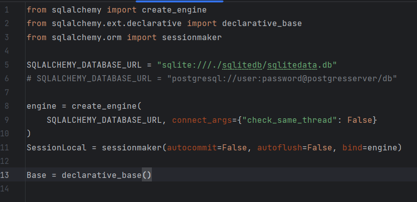

##models.py
Hier definieert men twee SQLAlchemy-modellen, Person en Gym, die overeenkomen met de "Persons"- en "Gyms" tabellen in de database. Het Person-model bevat kolommen voor id, name, email, en is_active, evenals een relatie (gyms) met het Gym-model. Aan de andere kant heeft het Gym-model kolommen voor id, name, location, en member_id, waarbij de laatste een ForeignKey is die verwijst naar het id van een persoon. Daarnaast heeft het Gym-model een relatie (member) met het Person-model, wat de bidirectionele relatie tussen de twee modellen vormt.
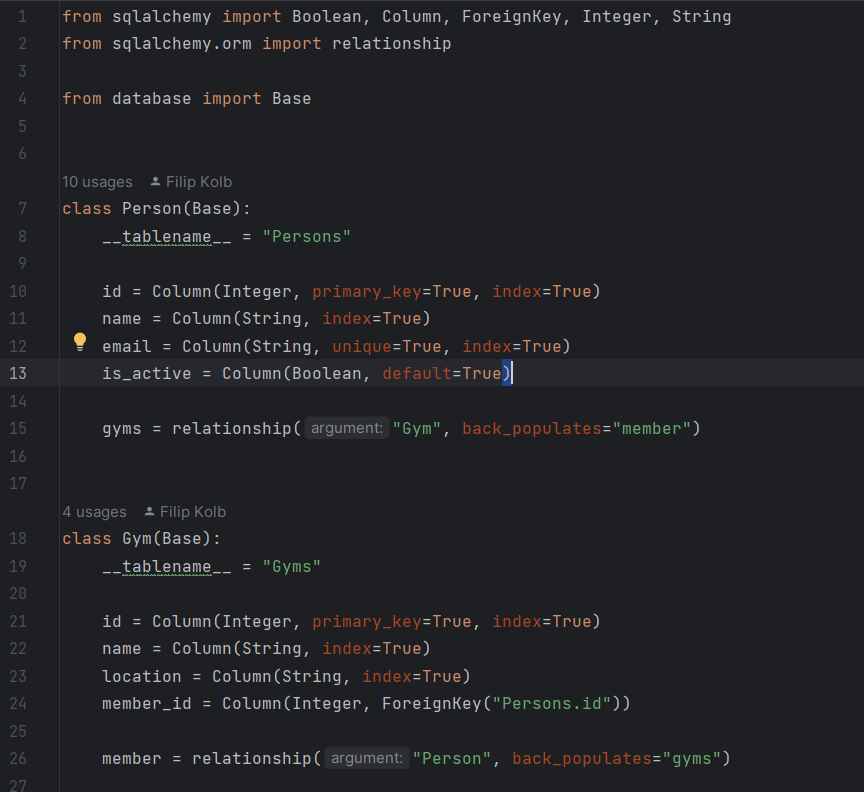

##schemas.py
Deze code maakt Pydantic-modellen voor gegevensvalidatie in een webapplicatie. Voor fitnessen(Gym) zijn er drie modellen: **GymBase** bevat basisgegevens, **GymCreate** wordt gebruikt bij het maken van nieuwe fitness, en **Gym** voegt een ID-veld toe voor gebruik met SQLAlchemy-ORM. Voor personen (Person) worden vergelijkbare modellen gebruikt. Het model **PersonGymAssignment** specificeert de toewijzing van personen aan fitnessen. Deze modellen vergemakkelijken consistent gebruik van gegevens en bieden validatie.
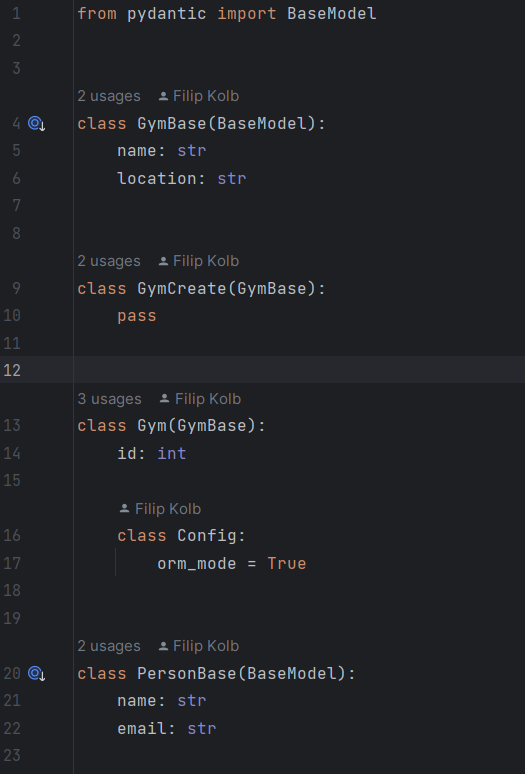
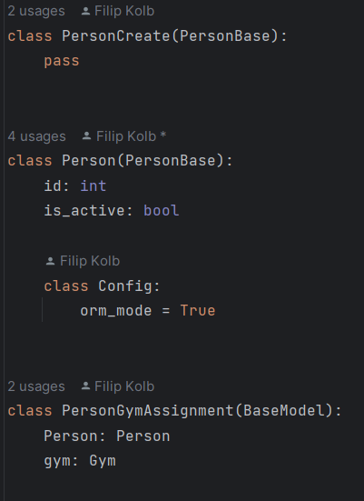

##crud.py
Deze file bevat create, read, update en delete functies voor database-interacties in een webapplicatie, gebruikmakend van SQLAlchemy.

Er zijn functies om individuele personen op te halen op basis van hun ID of e-mail, om een lijst met personen op te halen met optionele paginering, om nieuwe personen te creëren, en om personen te verwijderen.

Vergelijkbare functies zijn aanwezig voor sportscholen, zoals het ophalen van een lijst met sportscholen en het toewijzen van een persoon aan een sportschool.

De code maakt gebruik van modellen (models) en schemas (schemas) om de interactie met de database te structureren en te valideren. Elke functie ontvangt ook een Session-object als een databaseverbinding.

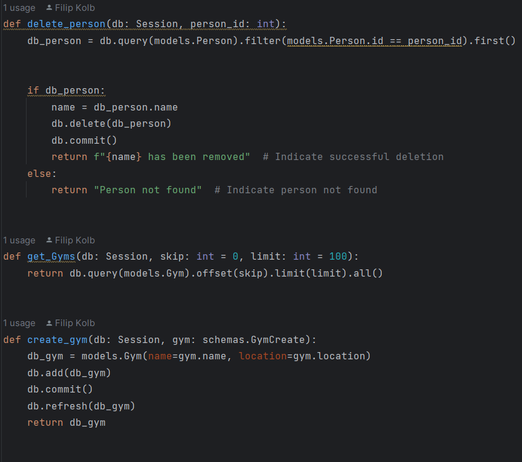
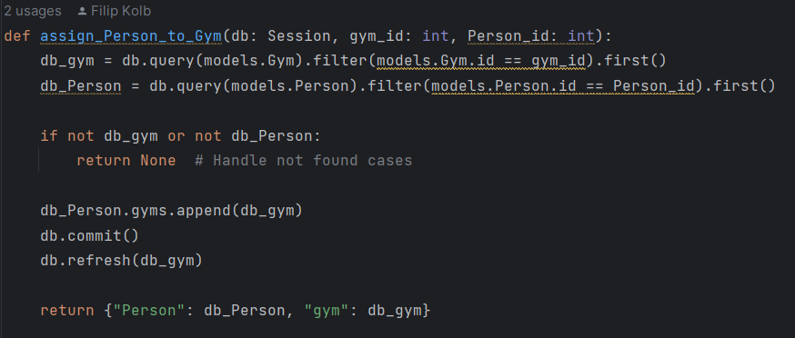

##main.py
Deze code implementeert een FastAPI-webapplicatie voor het beheren van personen en sportscholen met behulp van een SQLite-database via SQLAlchemy. De applicatie maakt gebruik van CRUD (Create, Read, Update, Delete) operaties om gegevens te beheren.

Bij het starten van de applicatie wordt gecontroleerd of de map 'sqlitedb' bestaat en zo niet, wordt deze aangemaakt. Daarna worden de database-tabellen aangemaakt met behulp van de SQLAlchemy-modellen.

De app heeft endpoints voor het maken, lezen en verwijderen van personen en sportscholen, evenals het toewijzen van een persoon aan een sportschool. Pydantic-schemas worden gebruikt voor gegevensvalidatie.

De applicatie maakt ook gebruik van dependency injection om een database-sessie te verkrijgen voor elke endpoint, waardoor de interactie met de database wordt mogelijk gemaakt. Er zijn ook foutafhandelingsmechanismen ingebouwd, zoals het teruggeven van HTTP-foutcodes en details bij ongeldige verzoeken of ontbrekende gegevens.
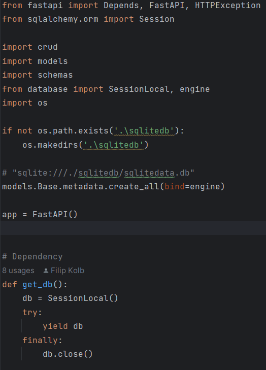
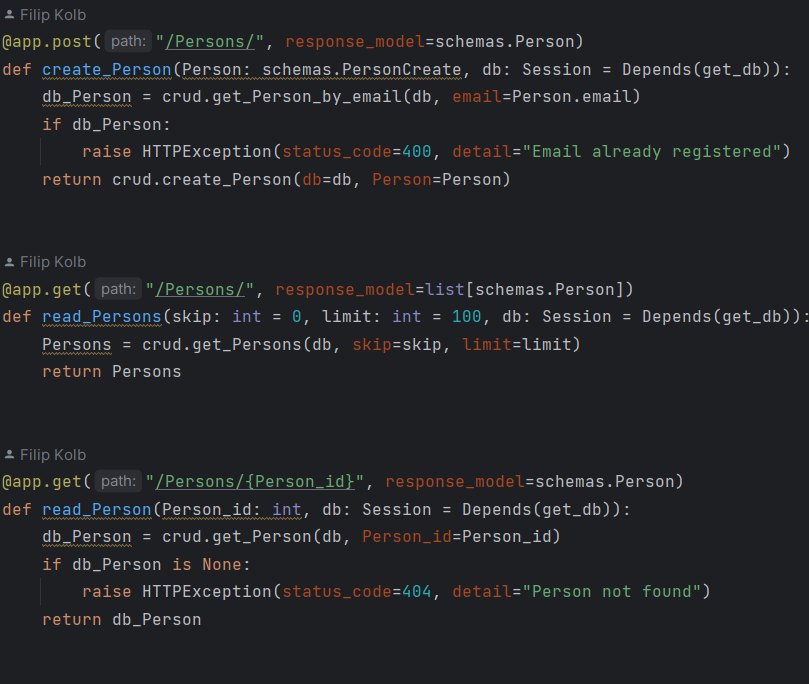
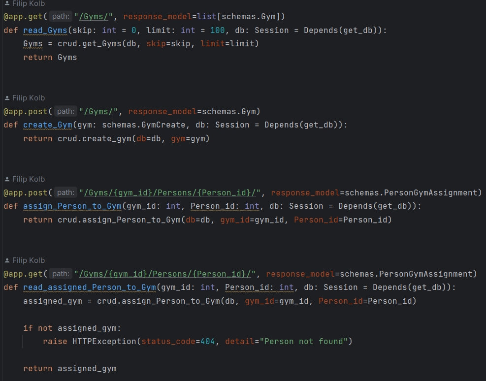

##__init__.py
Dit bestand zegt gewoon dat de directory gemarkeerd moet worden als een Python pakket.

##Postman requests
Hier zien we de Postman request dat we sturen naar onze API om data toe te voegen, te lezen en te deleten.

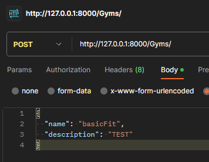
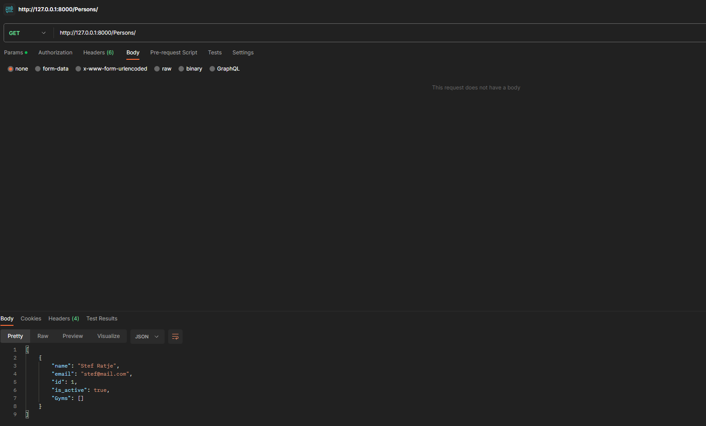
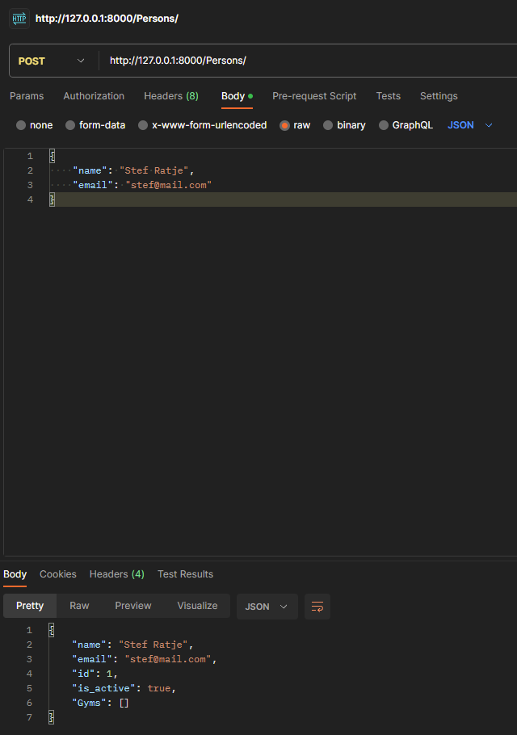
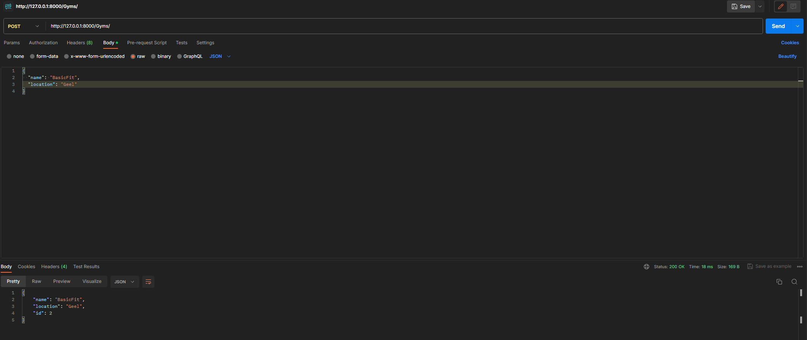
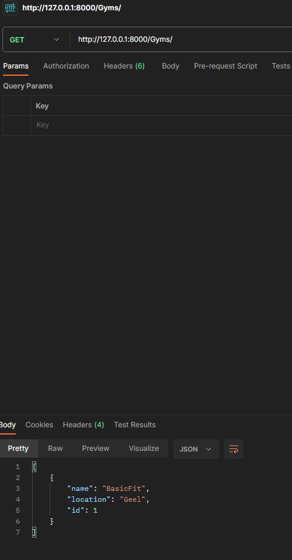
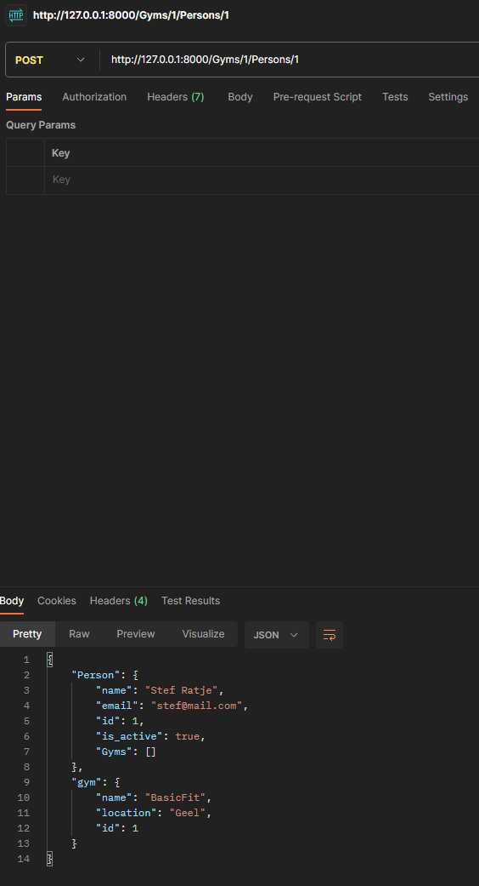
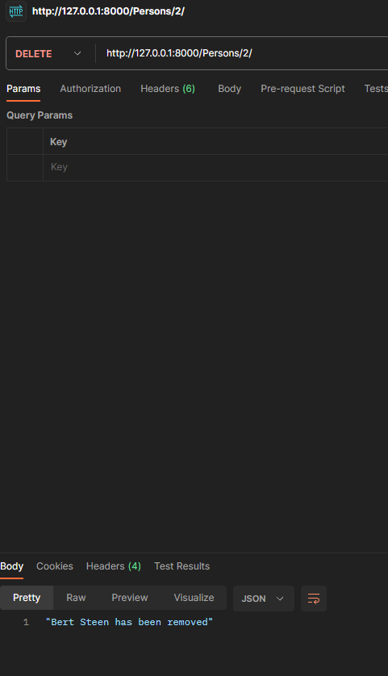
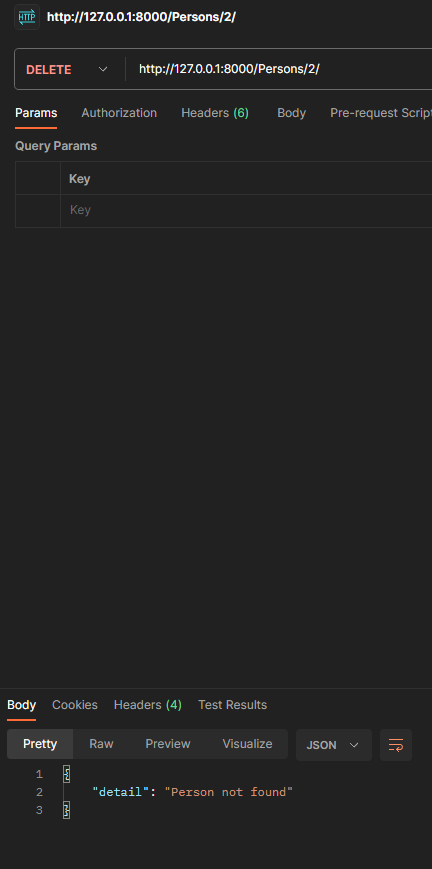

##Github actions
Deze YAML-configuratie definieert een GitHub Actions-workflow met de naam "Deliver container". De workflow wordt geactiveerd bij elke 'push'-gebeurtenis in de repository.

De workflow heeft een enkele job genaamd "delivery", die wordt uitgevoerd op het nieuwste Ubuntu distro. De stappen binnen deze baan omvatten:

Haal de repository op met behulp van de GitHub Actions-actie 'checkout'.

Meld aan bij Docker Hub met behulp van de opgegeven Docker-gebruikersnaam en -wachtwoord, die als secrets variabelen zijn opgeslagen in GitHub.

Bouw een Docker-container.

Upload de gebouwde Docker-container naar Docker Hub.

Deze workflow automatiseert het proces van het bouwen en leveren van een Docker-container naar Docker Hub wanneer er wijzigingen in de repository zijn gepusht.

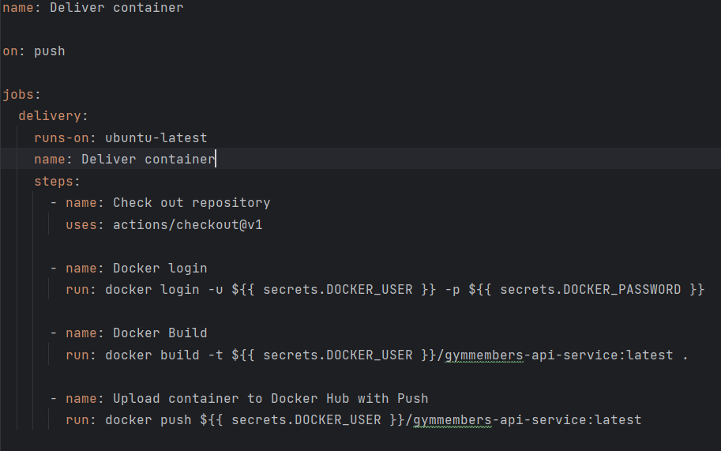

##docker/docker-compose
Deze Dockerfile definieert de configuratie voor het bouwen van een Docker-image. Het begint met het gebruiken van de officiële Python 3.10.0-slim base image. Daarna wordt de werkdirectory ingesteld op '/code', en poort 8000 wordt blootgesteld voor het accepteren van verbindingen.

Vervolgens wordt het bestand 'requirements.txt' van het lokale systeem naar de werkdirectory in de image gekopieerd. Daarna worden de vereiste Python-pakketten geïnstalleerd met behulp van 'pip' op basis van de inhoud van 'requirements.txt'.

Daarna wordt de inhoud van de lokale 'myproject'-directory naar de werkdirectory in de image gekopieerd.

Er wordt ook een map 'sqlitedb' aangemaakt binnen de werkdirectory.

Tenslotte wordt het commando uvicorn main:app --host 0.0.0.0 --port 8000 opgegeven als de standaard opstartopdracht voor de container. Dit commando start een webserver voor het uitvoeren van een FastAPI-applicatie op host "0.0.0.0" en poort "8000"

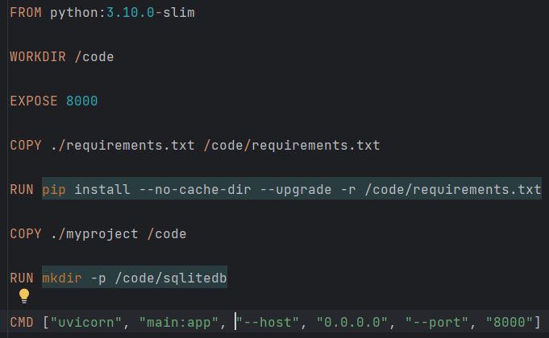
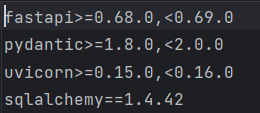

Deze Docker Compose-configuratie definieert een set services binnen een Docker-compose YAML-bestand. In dit geval wordt één service genaamd "gymmembers-api-service" gedefinieerd.

De service maakt gebruik van het Docker-image "filipkolb/gymmembers-api-service". De service wordt toegankelijk gemaakt op poort 8000 op de hostmachine door deze te koppelen aan poort 8000 in de container. Er wordt ook een volume met de naam "sqlite_api" gecreëerd, dat de '/code/sqlitedb' directory in de container mount naar een volume.

Ten slotte wordt een apart volume met de naam "sqlite_API" gedefinieerd. Dit word gebruikt voor het delen van gegevens tussen services of voor persistente opslag

##Okteto 
Nu dat we op docker-hub onze image hebben van de API kunnen we gaan deployen. We koppelen onze github account en selecteren de repository en starten de dev omgeving op. Nu laten we docker werken om de API te deployen.
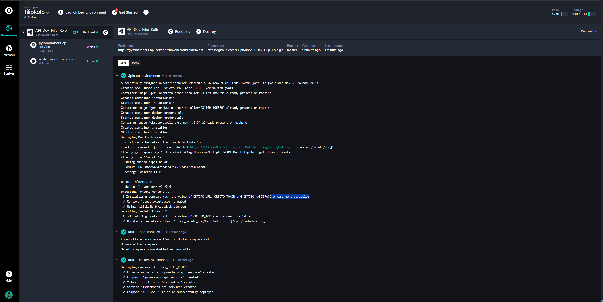
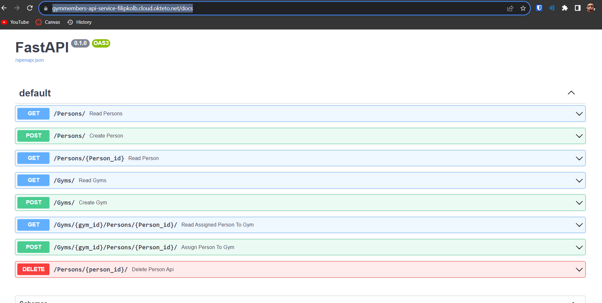

[OKTETO HOSTED SITE](https://gymmembers-api-service-filipkolb.cloud.okteto.net/docs)